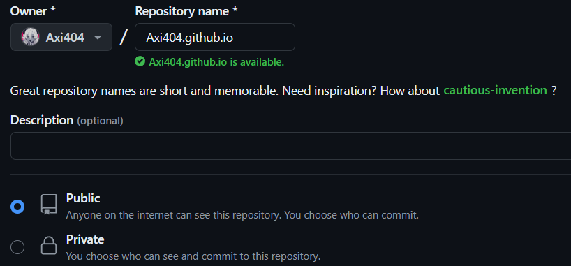

## 前言

本教程是关于 Actions 以及 Pages 的一些分享，最近一段时间在 Github 上面发烧了一阵子，狠狠的制作了一些开源的项目，自然也存在一些摸索性质的内容，而摸索出了答案，也就是时候出一篇教程来写一写，正好，本博客风格赏心悦目，值得一试。

## 关于 Github Pages

首先需要提及的是 Github Pages，简单来说，这是一种 Github 提供的静态网站托管服务，至于什么是静态网站，一种简易的理解是，至少上面不会有一个数据库，网站也不存在任何对数据的读写操作，一切的风格化变化只来自于网站提前搭建好的框架。

基于这种特性，不难理解的是，Github Pages 尤其擅长处理一些类似于博客、文档、教程一类的网站，甚至说我们的 [CSBAOYANDDL](https://cs-baoyan.github.io/CSBAOYANDDL/) 也通过一种取巧的方式，可以通过 Github Actions 维护一个类似于数据库的内容。

在提供静态网页这件事情上，Github 可以说是十分慷慨的，每一个用户可以创建近乎无限的仓库，而每一个仓库都可以对应一个 Github Pages————只要你知道如何设置（而这一点我们会在后面提及）。

## 关于 Github Actions

Github Actions 是一个持续集成和持续部署（CI/CD）平台，它允许用户在 Github 上创建自动化流程，用于构建、测试和部署项目，其支持使用 YAML 文件定义工作流程，并且可以与 Github 上的其他服务进行交互，换句话来说，Github Actions 支持我们在 Github 这个理论来说静态的平台上面运行一个脚本。

通过上述的内容，细心的读者应当不难发现，Pages 提供静态服务，而 Actions 则可以运行脚本，二者的互补之下，很多内容都成为了可能，不过本篇中不得不遗憾地告诉读者，Actions 在其中并不发挥着过多的作用，大多数的内容仅是基于现如今成熟的网页模板以及 Github Pages 的静态网站部署，便已经结束了。

## 部署你的第一个网站

在很多的教程中，往往都会教学如何建立一个自己的博客或者主页，通过 Github Pages 的方式。然而这些方法往往问题很大，即会让读者产生一种错觉，一个账户只能创建一个静态网站。

让我们回顾一下这些教程说的内容，首先，在自己的账户中创建一个仓库，这个仓库的名字需要是 `yourname.github.io`，对于笔者来说，也就是创建一个名为 `Axi404.github.io` 的仓库。

