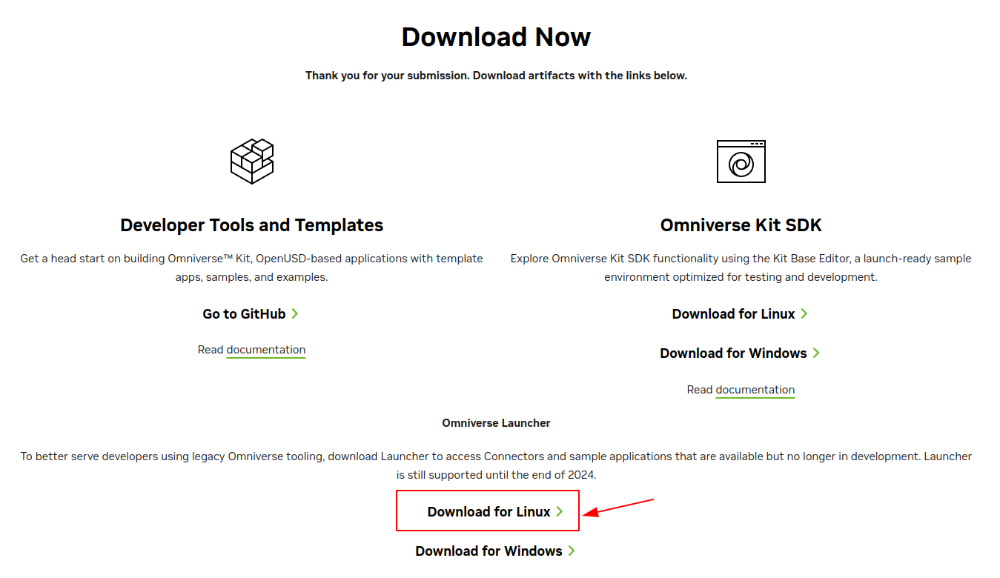
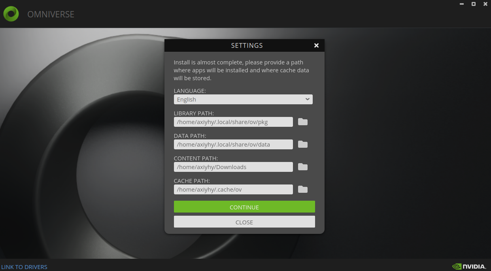
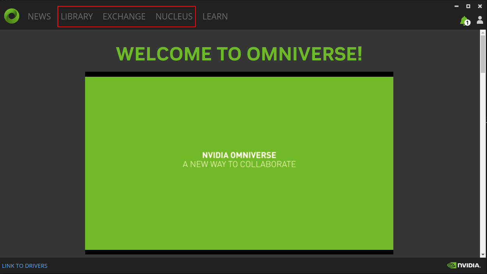
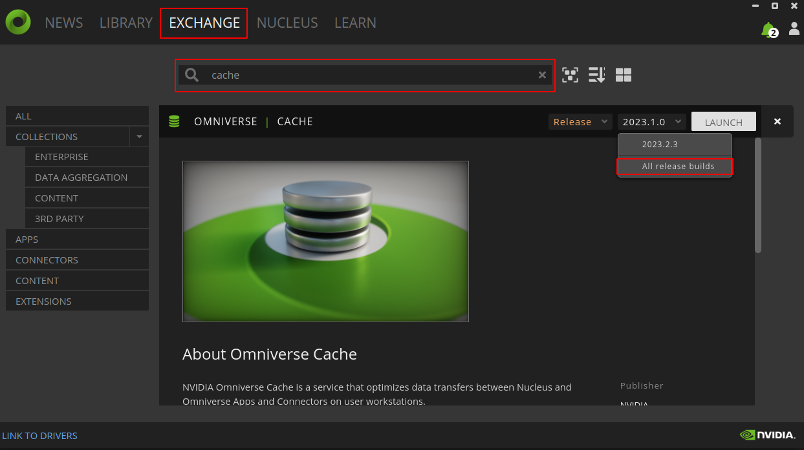
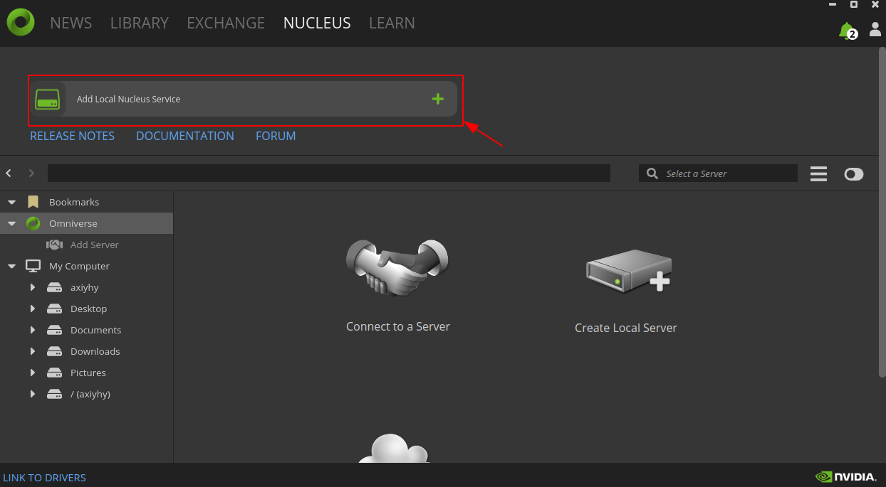
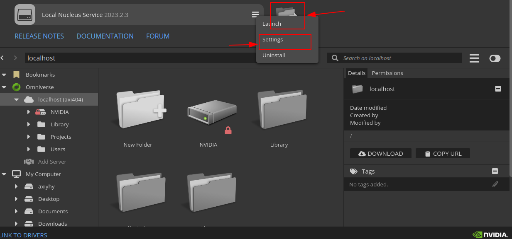
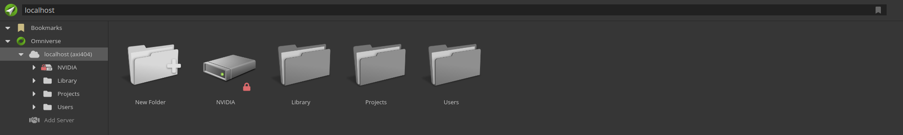

## 前言

因为科研的需要，所以说需要安装一下仿真的环境，领域里面最通用的环境就是 Isaac Sim 了，但是据说也比较复杂，老师推荐了另一个 simulator（Sapien），说是比较轻量级，但是为了以后和其他工作更好地对接，以及之后估计半年多一年还是远程，有必要成为模拟器大师，于是挑战一下自己。

这篇日记依然和 LLM Talk 系列一样，应该是无限期更新的，包括说正常的安装以及操作的一些记录（对于一些涉密的内容，不会涉及），一些模块的学习，以及一些报错的整理。一方面是给自己作为一个笔记，一方面也是假如说有将来的同学进组，可以有一些更加明确的指引。毕竟本人是英文苦手，看英文的速度完全做不到“扫过”，所以还是有必要记录一下的。

## 安装 Isaac Sim

首先先简单说一下什么是 Isaac Sim，这是一个在 Nvidia 的 omniverse 下的一个 App，可以完成各种的仿真，也支持 ROS 的接口（虽然我目前还不知道 Embodied 的这一套流程是否和 ROS 有接壤），所以说做机器人这方面，用这个的比较多。而且这个东西是可以生成 image（镜像）并且运行在服务器上的，所以说各种意义上的符合具身智能领域的各种需求。

既然是 Nvidia 的产品，拥有一个 Nvidia 的账号也就是必须的事情了，一般来说还是推荐通过谷歌邮箱之类的 Mail 去注册，在这里不去赘述这个事情。

### 环境概述

按照常规的教程来说，反正首先概述一下环境。本人的环境如下，作为参考，当然，这套环境貌似在一些性能上不是很可以，不知道能否坚持到最后：

以下是 CPU 以及系统信息：

```text
root:~$ linuxlogo -a
              .-. 
        .-'``(|||) 
     ,`\ \    `-`.               88                         88 
    /   \ '``-.   `              88                         88 
  .-.  ,       `___:    88   88  88,888,  88   88  ,88888, 88888  88   88 
 (:::) :        ___     88   88  88   88  88   88  88   88  88    88   88 
  `-`  `       ,   :    88   88  88   88  88   88  88   88  88    88   88 
    \   / ,..-`   ,     88   88  88   88  88   88  88   88  88    88   88 
     `./ /    .-.`      '88888'  '88888'  '88888'  88   88  '8888 '88888' 
        `-..-(   ) 
              `-` 

Linux Version 5.15.0-117-generic, Compiled #127~20.04.1-Ubuntu
16 2.3GHz Intel i7 Processors, 128TB RAM, 73728 Bogomips Total
```

由于本人更换系统的意愿（见 [Strange Bugs](https://axi404.github.io/Blog/p/%E5%A5%87%E5%A5%87%E6%80%AA%E6%80%AA%E7%9A%84-bug-%E9%9B%86%E6%95%A3%E5%9C%B0/)，Ubuntu 20.04 日常使用已经很不方便），在安装 Isaac Sim 之后的内容均在 Ubuntu 22.04 上进行，如存在其他版本的信息，会专门注明补充。此系统的信息如下：

```txt
root:~$ linuxlogo -a
              .-. 
        .-'``(|||) 
     ,`\ \    `-`.               88                         88 
    /   \ '``-.   `              88                         88 
  .-.  ,       `___:    88   88  88,888,  88   88  ,88888, 88888  88   88 
 (:::) :        ___     88   88  88   88  88   88  88   88  88    88   88 
  `-`  `       ,   :    88   88  88   88  88   88  88   88  88    88   88 
    \   / ,..-`   ,     88   88  88   88  88   88  88   88  88    88   88 
     `./ /    .-.`      '88888'  '88888'  '88888'  88   88  '8888 '88888' 
        `-..-(   ) 
              `-` 

Linux Version 6.8.0-40-generic, Compiled #40~22.04.3-Ubuntu
16 4.6GHz Intel i7 Tigerlake Processors, 31.1GB RAM, 74k Bogomips
```

以下是显卡信息，因为是笔记本，我的显卡是 8GB 的 RTX 3070 Laptop：

```text
root:~$: nvcc --version
nvcc: NVIDIA (R) Cuda compiler driver
Copyright (c) 2005-2023 NVIDIA Corporation
Built on Tue_Feb__7_19:32:13_PST_2023
Cuda compilation tools, release 12.1, V12.1.66
Build cuda_12.1.r12.1/compiler.32415258_0
```

我的电脑是 Dell 的 Alienware m15 R6。

### 下载 omniverse-launcher

就像是之前说到的一样，Isaac 的 omniverse 下的一个 App，所以说在安装 Isaac 之前要先安装 omniverse-launcher，也是比较简单的，在官网 [https://www.nvidia.com/en-us/omniverse/download/](https://www.nvidia.com/en-us/omniverse/download/) 进行安装就好。进入下载页面之前会要求输入一些个人信息，随意写一下就好，理论来说 nvidia 账号中已经包含了这些内容，所以会自动填写。



下载下来之后是一个 `.AppImage` 的文件，按照我的惯例，就直接运行了：

```bash
cd ~/Downloads
wget https://install.launcher.omniverse.nvidia.com/installers/omniverse-launcher-linux.AppImage
sudo chmod +x omniverse-launcher-linux.AppImage
./omniverse-launcher-linux.AppImage
```

对于 Ubuntu 22.04，可能会报错 `AppImages require FUSE to run.`，按照提示信息，安装 `sudo apt install libfuse2` 即可。

运行之后产生登录页面，本质上还是 nvidia 账号，点击 `LOG IN` 之后会跳转到网页，输入帐号密码登录即可。然后同意若干的协议，进入如下界面：



这些路径按照默认配置即可。选择确认，进入主界面：



其中比较重要的是 `Library`/`Exchange`/`Nucleus`，第一个是已经安装的内容的管理，第二个是安装内容的途径，第三个是一种中央数据库和协作引擎。

### 安装并启动 Isaac Sim

进入 Exchange 进行安装，首先安装 cache，搜索之后下拉版本，选择 `2023.1.0`，并点击 install 即可。



然后点击 Nucleus，选择 Add local Nucleus Service：



会要求设置 path 以及 admin account，自行设置即可。

最后在 Exchange 中安装 Isaac Sim，同样是搜索，版本选择 `2023.1.0-hotfix.1`，点击 install。

> 本人目前选择安装 `4.1.0` 版本，且之后内容均在此版本下进行。

在 Nucleus 下载完毕之后，可以找到两个本地的服务：



其中选择 Settings，可以在网页中看到如下内容：

> 值得注意的是，在第二次或者以后启动的时候，可能会出现进入其 Settings 链接 `http://localhost:3080/` 之后为一片白色的情况，而 Cache 没有正确启动，导致后续的程序无法运行，解决方法之一是，可以进入其子窗口 `http://localhost:3080/cache`，再点击上方的 `Apps`，之后 `Restart all` 即可。


假如出现问题，如显示 Stop 或者 Error，请检查之前说的版本问题。假如 cache 版本不对，重新卸载并且安装，然后点击 Launch 即可。

选择文件夹图标的内容，可以在网页中看到如下的内容：



均确认无误之后，可以在 Library 中选择 Isaac Sim 并且点击 Launch。

## Standalone Pick and Place 代码实现

```python
from isaacsim import SimulationApp
simulation_app = SimulationApp({"headless": False}) # we can also run as headless.

from omni.isaac.core import World
from omni.isaac.core.objects import DynamicCuboid
import numpy as np

world = World()
world.scene.add_default_ground_plane()

cube1 =  world.scene.add(
    DynamicCuboid(
        prim_path="/World/cube1",
        name="cube1",
        position=np.array([0, 0, 1.0]),
        scale=np.array([0.5015, 0.5015, 0.5015]),
        color=np.array([0, 0, 1.0]),
    ))

franka = world.scene.add(Franka(prim_path="/World/Franka", name="franka"))

controller = PickPlaceController(
            name="pick_place_controller",
            gripper=franka.gripper,
            robot_articulation=franka,
        )

camera = Camera(
    prim_path="/World/camera",
    position=np.array([0.0, 0.0, 25.0]),
    frequency=20,
    resolution=(256, 256),
    orientation=rot_utils.euler_angles_to_quats(np.array([0, 90, 0]), degrees=True),
)

world.reset()
camera.initialize()
camera.add_motion_vectors_to_frame()

franka.gripper.set_joint_positions(franka.gripper.joint_opened_positions)

while simulation_app.is_running():
    position, orientation = fancy_cube.get_world_pose()
    goal_position = np.array([-0.3, -0.3, 0.0515 / 2.0])
    current_joint_positions = franka.get_joint_positions()
    actions = controller.forward(
        picking_position=cube_position,
        placing_position=goal_position,
        current_joint_positions=current_joint_positions,
    )
    franka.apply_action(actions)
    world.step(render=True)

simulation_app.close() # close Isaac Sim
```