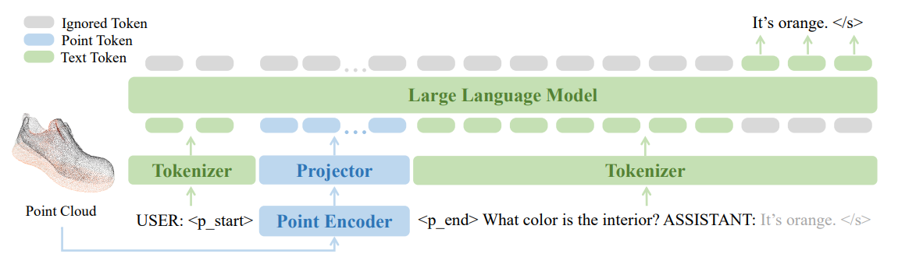
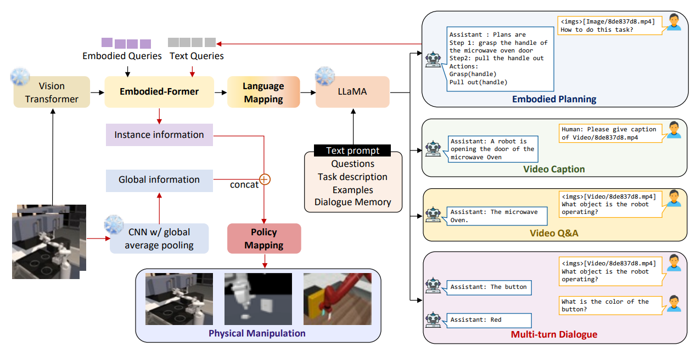
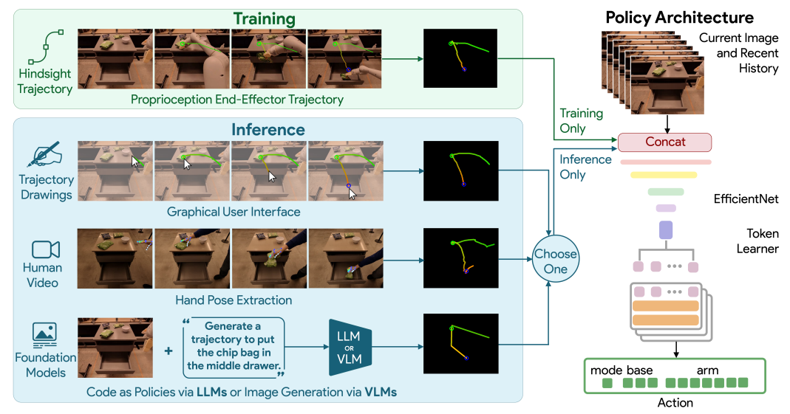
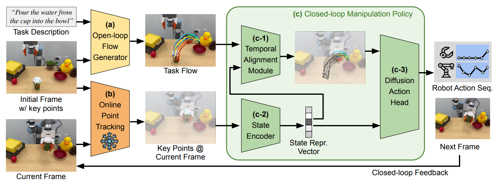
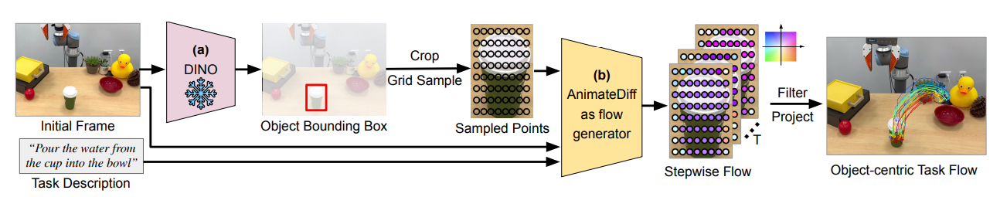
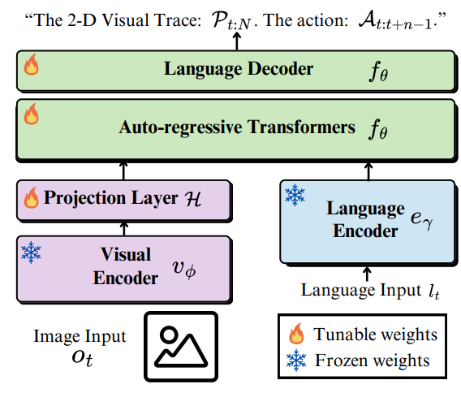
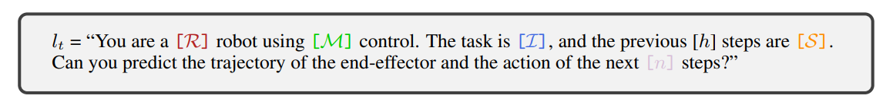

## 前言

在代表性工作之余，也有必要阅读一些其他的内容，这当然也需要总结，所以新开设一个章节，记录在这里。

## [PointLLM](https://arxiv.org/pdf/2308.16911)

PointLLM 可以是说十分标志的工作了，属于是中规中矩，但是效果确实很不错。就像是一般的 VLM 一样，但是只不过是将图像的模态输入换成了点云，然后使用 point encoder，总体来说改变并不算多。可以说这篇工作的诞生是符合直觉的，点云模态也可以作为一种语言进行建模。

## [EmbodiedGPT](https://arxiv.org/pdf/2305.15021)

EmbodiedGPT 也是一篇比较符合直觉的工作，但是不是那么的极简。本身是按照 BLIP2 的范式来的，用了一个 Embodied-Former（其实也就是 Q-former）来连接 ViT 和 LLaMA3，来做一个桥梁，之后输出一个 instance information，一个 CNN 处理图像输出一个 global information，两个 concat 一下作为 low-level policy 的输入。

本身值得说的是，一方面这种设计，为什么不单独通过 embodied-former 直接输出的 instance information 呢？毕竟也是通过了 ViT 的信息编码的，之所以还需要一个 CNN，大概率是这样做了之后发现表征能力不强，所以需要更加显式的提供一些信息。

## [RT-Trajectory](https://arxiv.org/pdf/2311.01977)

RT-Trajectory 是一个输出 low-level policy 的模型，使用了 RT-1 的框架作为动作的输出，在此之前会输入之前和当前的帧以及一个工作轨迹，这里面动作轨迹通过 R 和 G 两个通道表征了时间顺序以及高度信息，和图像一起输入。因为从文字 prompt 改为了图像（轨迹），所以本质上具有更高的细粒度，性能更好也很正常。

## [Im2Flow2Act](https://arxiv.org/pdf/2407.15208)

Im2Flow2Act 算是一篇比较有意思的工作，本身应该是 ATM 的后续工作，不过因为糟糕的阅读顺序，我其实是先阅读的这一篇。

因为确实需要的前置知识还是很多的，所以说先暂且形而上学的理解一下这个问题，后续估计需要详细的看一看相关的论文。Im2Flow2Act 的核心思想在于，首先根据任务生成对象流，对象流就具有很高的细粒度了，之后对象流通过模仿学习来获得动作规划。

这篇工作使用了 Diffusion 里面的动作生成（视频生成）作为流生成的方法。首先先框出来一个物体，在物体上面可以采样若干的关键点，这些点就组成了一个 $H\times W$ 的图片，但是这个图片不是正常的图片，和RT-Trajectory 里面的轨迹图片一样，是通过像素表征了别的信息，这里面就是图像系下的坐标和可见度。那么根据条件输入，就可以生成视频了，而这个视频本质上表征的是这个物体在不同时刻的空间信息。

流生成了之后，基本上是直接使用模仿学习进行的运动规划，用了 Transformer 去编码当前帧的状态，再用 Transformer 去和任务流做融合，来生成剩余的流，最后交给 Diffusion Policy 去生成动作。

粗浅的凑一下的话，创新性在于使用生成式的方法生成高细粒度的物体流，显然是优于 RT-Trajectory 的，同时第二阶段的时候使用当前的状态和任务流做融合，有一种 nav 中全局规划和局部规划的意味，但是并不完全。总的来说是一篇 based 轨迹的动作规划的很不错的工作，而且相较于 RT-Trajectory，更有细粒度，而且保证了公平性。

## [LLARVA](https://arxiv.org/pdf/2406.11815)

LLARVA 相较于之前的工作，可以说也是一个比较符合直觉的工作，使用指令调优（IT）的方法进行训练，也是处理了 OXE 这个数据集。从 Pipeline 也不难看出，LLARVA 是一个比较经典的架构，基本上也是 LLAVA 的框架，训练一个 projection layer 以及后面的 Transformer 做对齐以及模态的融合。

其创新点其实有点 World Model 的意思，通过让模型预测将来的视觉轨迹这种更具细粒度的内容，之后输出 Action，这明显是一个更加困难而且包含了更多未来信息的任务，所以效果会更好也是显而易见的。当然，本身 IT 的方法，自然也可以让模型更好地完成任务就是了。

## [ATM](https://arxiv.org/pdf/2401.00025)

这篇论文可以说影响力还是很拉满的，对于后续的一些轨迹 based 的工作，比如 Im2Flow2Act，明显是有很大的影响的，本身也是拿了 RSS 的满分，不过因为理解了之前的这些论文，这一篇其实很好理解。

## [Track2Act](https://arxiv.org/pdf/2405.01527)

## [Extreme Cross-Embodiment](https://arxiv.org/pdf/2402.19432)

## [ECoT](https://arxiv.org/pdf/2407.08693)

## [VoxPoser](https://arxiv.org/pdf/2307.05973)

## [MOO](https://arxiv.org/pdf/2303.00905)

## [ChatGPT for Robotics](https://arxiv.org/pdf/2306.17582)

## [PIVOT](https://arxiv.org/pdf/2402.07872)

## [Code As Policies](https://arxiv.org/pdf/2209.07753)